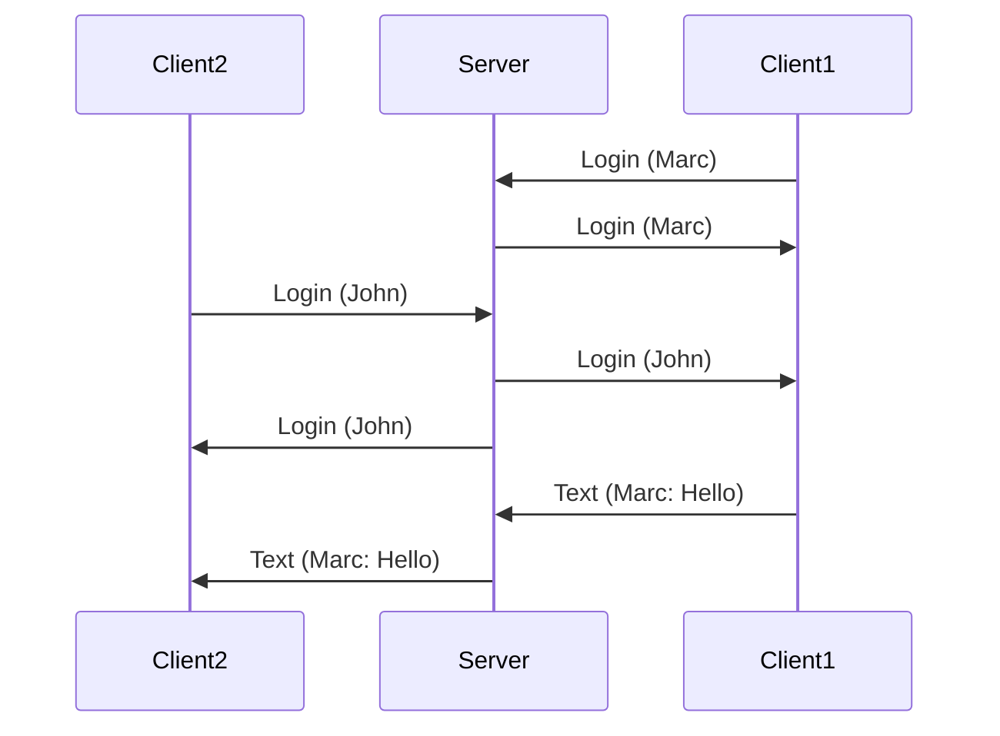
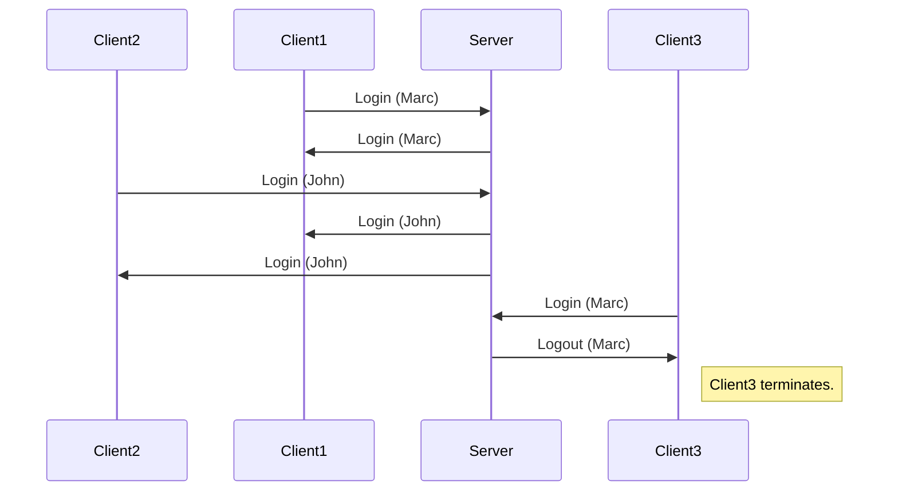

# mini_chat

A tiny prototypical chat app written in C++.

Restrictions:
- use berkeley sockets
- pthreads

The project can be build via CMake or using the makefile. Two separate targets are available:

- `server`, which can then be executed like `./servver <listening_port>`
- `client`, which can then be executed like `./servver <username> <server_ip>:<server_port>`

A few chat properties:
- Redundant usernames are not allowed. In such cases the newest client will terminate.
- Clients are notified of entering and leaving clients.
- Entering `exit` as sole input closes a client.
- Pretty sure I dont catch all possible errors, but many of them.

## Lazy limitations (Things I didn't do)

- A proper message struct: The struct to send messages uses fixed sized character arrays. 
There are no checks to prevent any errors caused by too long messages etc.
Defining a better message format OR handling all possible errors would have taken too much time with very little gain though.
- Exceptions: I did not properly catch all exceptions (as the previous point already made clear). In some cases, e.g. a non reachable server, I simply print an error code and terminate. I simply did not want to invest too much time on proper error messages for this POC.
- UI/Formatting: Command line chats look and feel awful. But I assumed that a beautiful UI or even formatting wasn't really the point of this exercise. Syncing out of order messages may have been an exercise on its own.
- Multi platform tests. I tested on MacOS. Using posix threads should make it fine for Linux. I did not care about Windows here.
- Modernization/Linting/Code-Formatting: A usual project would at least get clang-tidy, cpplint, ASAN, TSAN, UBSAN, and some clang-formatting. Maybe some results from flawfinder and rats. But I assumed that this was as well not the point of the exercise.

## Some diagramms

Maybe these exemplary sequence diagramms explain what I had in mind.

Two successful logins and some chatting.

Two successful logins and an unsuccessul one because of an already given taken name.

