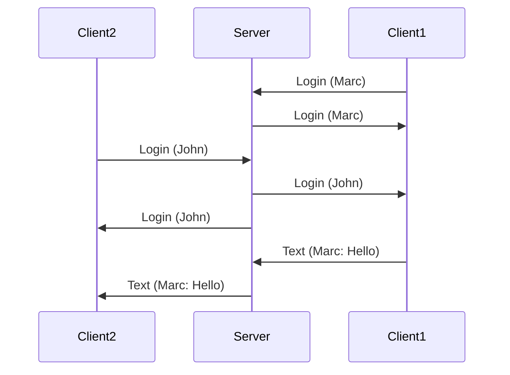
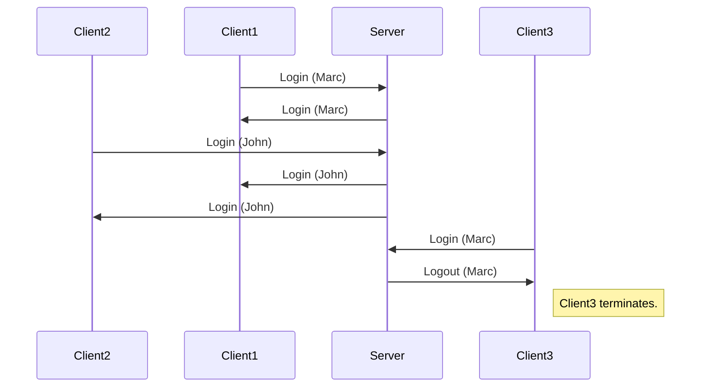

# mini_chat

A tiny prototypical chat app written in C++.

Restrictions:
- use berkeley sockets
- pthreads

The project can be build via CMake or using the makefile. Two separate targets are available:

- `server`, which can then be executed like `./servver <listening_port>`
- `client`, which can then be executed like `./servver <username> <server_ip>:<server_port>`

A few chat properties:
- Redundant usernames are not allowed. In such cases the newest client will terminate.
- Clients are notified of entering and leaving clients.
- Entering `exit` as sole input closes a client.
- Pretty sure I dont catch all possible errors, but many of them.

Two successful logins and some chatting.

Two successful logins and an unsuccessul one because of an already given taken name.

